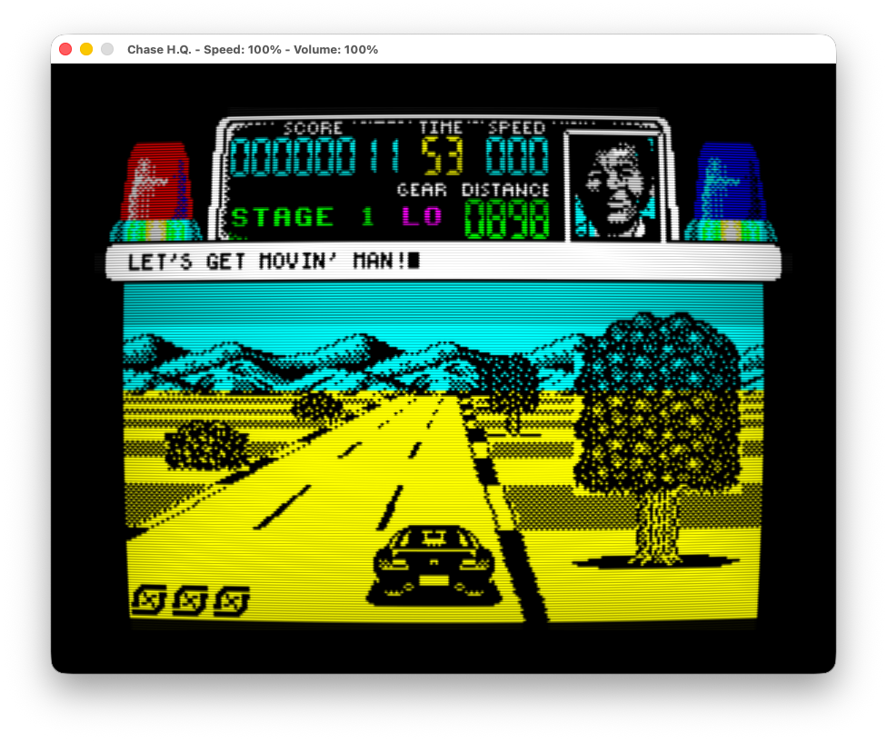

# Rebuilding ZX Spectrum _Chase H.Q._ in C

Reimplementation by David Thomas, 2023-2026

<p align="center">
  
</p>

This directory holds a mostly hand-written, human-readable C reimplementation of
the ZX Spectrum _Chase H.Q._ game engine. It's not a decompiler dump - it's
intended to be read and learned from. Every function is translated from the
[SkoolKit disassembly](../Speccy/README.md), with the original Z80 addresses
kept in the comments so the two can be read side by side, compared (and
debugged).

Since it's a direct port of a Speccy game it inherits all the ZX Spectrum
limitations too. Screen resolution, depth and organisation are as the original.
Keyboard and sound too. Think of it as a Spectrum emulator without the, err,
emulator...

See the [sister project README](../Speccy/README.md) for the disassembly that
this is derived from.

## Status

- The game is **complete** but there may be conversion bugs remaining. The
  original game is very reliant on self-modified instructions, values and Z80
  wizardry. Debugging my hand conversion into a working state has been
  considerable effort.
- Engine logic translated across `Main.c` (~22.5k lines of fun), `Bank3.c`
  (~11.5k lines of 128K title-screen/tune code) and `Bank7.c` (~2.3k lines of
  end screen animation).
- All five stages have the original per-stage road, object and sprite data
  (`Stage1Data.c`–`Stage5Data.c`).
  - There's a sixth test stage in the mix for playing around with.

## Source Layout

- `include/<Module>/` — public headers (`C99/Types.h`, `ZXSpectrum/*.h`,
  `ChaseHQ/ChaseHQ.h`)
- `libraries/ZXSpectrum/` — a thin ZX Spectrum facade:
  `in`/`out`/`draw`/`stamp`/`sleep` callbacks and a screen buffer. Game code
  never touches SDL.
- `libraries/ChaseHQ/Engine/` — the game itself: `Main.c`, `Bank3.c` (128K title
  screen and tune player), `Bank7.c` (end sequence), `State.h` (all mutable
  state, ordered by original Z80 address)
- `libraries/ChaseHQ/Data/` — read-only tables: stages, sound samples, title
  screen, bank 3 data
- `apps/sdl3/` — the host: SDL3 window, event loop, audio and a CRT shader
- `Tests/` — unit tests and a standalone stretchy-object renderer
- `docs/` — how the road drawing works, the stage data format, translation
  principles and a catalogue of Z80-to-C pitfalls

## Building

CMake is the canonical build system. SDL3 is required.

```sh
cmake -S . -B cmake-build-debug -DCMAKE_BUILD_TYPE=Debug
cmake --build cmake-build-debug
./cmake-build-debug/ChaseHQ
```

Unit tests:

```sh
cmake --build cmake-build-debug --target ChaseHQ_Tests
./cmake-build-debug/ChaseHQ_Tests
```

## [`apps/riscos/`](apps/riscos/README.md) — native RISC OS application

A self-contained 32-bit `!ChaseHQ` desktop application, built from the same
engine sources by @gerph. See that directory's README for build instructions and
host shortcuts.

## Controls

Driving uses the original game's default key definitions, which the in-game
redefine option can change:

| Key       | Action                 |
| --------- | ---------------------- |
| `K` / `L` | Steer left / right     |
| `A` / `Z` | Accelerate / brake     |
| `N`       | Change gear            |
| `SPACE`   | Turbo boost            |
| `P`       | Pause the current game |
| `Q`       | Quit the current game  |

A Kempston joystick is emulated on the arrow keys, using `.` for fire.

`Ctrl-G` turns on mouse steering: moving the mouse left/right steers (through
the same Kempston path as the arrow keys, so the in-game "KEMPSTON JOYSTICK"
control scheme needs selecting too), left click is gear, right click is turbo
boost. Off by default; toggling it off releases any held direction or button.

The host adds its own keys, which never reach the game:

| Key                   | Action                                                         |
| --------------------- | -------------------------------------------------------------- |
| `F1`                  | Pause                                                          |
| `F2`                  | Mute audio                                                     |
| `F3`                  | Show the dirty-rectangle overlay                               |
| `F4`                  | Toggle the CRT shader                                          |
| `F5` / `F6`           | Volume down / up                                               |
| `F7` / `F8` / `F9`    | Mute AY channel A / B / C                                      |
| `F10`                 | Mute the beeper/speaker                                        |
| `F11`                 | Toggle fullscreen                                              |
| `F12`                 | Toggle raw backbuffer ($F000) debug view                       |
| `Ctrl-M`              | Toggle monochrome (greyscale) display                          |
| `Ctrl-N`              | Toggle mellow (dimmed, desaturated CRT-style) palette          |
| `Ctrl-Y`              | One-shot glitch: fill the screen with random noise for a frame |
| `Ctrl-X`              | Toggle the "SHOCKED" test-mode cheat                           |
| `Ctrl-G`              | Toggle mouse steering (off by default)                         |
| `-` / `=`             | Window scale down / up                                         |
| `[` / `]`             | Emulation speed down / up (5% steps)                           |
| `Shift-[` / `Shift-]` | Emulation speed down / up (1% steps)                           |
| `Ctrl-[` / `Ctrl-]`   | Jump to minimum / maximum emulation speed                      |
| `\`                   | Reset emulation speed to 100%                                  |

Host keys use a 1990s TV style overlay to respond. This reuses the game's 8x8
font scaled to 8x16.

The "SHOCKED" cheat/test mode is off by default; toggle it with `Ctrl-X`. While
it's on and a level is running, `1` restarts it, `2` loads the next one and `3`
jumps to the end screen. On the title screen you can use 1-5 to play the
animations and 6 to enter hi-score entry.

## CRT TV shader

For a bit of fun I've added a CRT TV shader. This works on macOS, Linux and
Emscripten builds so far.

`F4` swaps the plain SDL blit for a CRT TV effect: barrel distortion, threshold
bloom, brightness/contrast/saturation, luminance-adaptive scanlines, a vignette
and a PAL colour bleed. The bleed models PAL's narrow chroma bandwidth — luma is
taken from the centre tap only while chroma is averaged over four leftward taps,
so colour smears rightwards and edges stay sharp.

With the shader up, its parameters can be tuned live:

| Key                   | Action                                                        |
| --------------------- | ------------------------------------------------------------- |
| `TAB` / `Shift-TAB`   | Select the next / previous parameter                          |
| `PAGEUP` / `PAGEDOWN` | Increase / decrease the selected parameter                    |
| `Ctrl-R`              | Turn every parameter off (flat 0.0/1.0 — the effect vanishes) |
| `Ctrl-T`              | Reset every parameter to its tuned defaults                   |

The selected parameter and its value are shown as an on-screen status flash on
each change. Nothing is saved between runs — settings that are worth keeping go
into `crt_tuned_params` in `apps/sdl3/SDLMain.c`.

## How the translation is written

The C is a model of a Z80 program, written to be read. Locals are named after
the original register that held the value (`A_prev_height`, `HL_backdrop`,
`DE_scr` - although naming is not 100% consistent), declared at the top of scope
in order of first use, each with a `/* intent (was X) */` comment. `EXX` and
`EX AF,AF'` banking is tracked via comments, because that gets confusing quickly
otherwise. Deliberate departures from a literal translation are marked with
`Conv:` comments.

`docs/translation-principles.md` and `docs/translation-pitfalls.md` cover this
in detail, and `docs/function_comment_template_example.c` is a worked example of
what a finished function might look like.

## Stage data

Stage data is extracted from the disassembly rather than typed in by hand:
`scripts/convert_stage.py` turns a bank skool file into a C stage data skeleton,
though not always successfully. See `docs/convert-stage.md` for usage and what
still needs completing by hand afterwards.

### Building your own stages

A stage's road is six parallel byte streams (curvature, height, lanes, hazards,
left/right objects) that are unreadable on their own and easy to desync.
`scripts/stage_compile.py` compiles a human-readable `.map` text table — one row
per slice of road, a column per stream — into those C arrays, and decompiles
existing stage data back into the same table for editing. `maps/stage1.map` is a
worked example; `maps/stage6.map` is the port's own hand-authored test stage,
built entirely from this format. See `docs/stage-text-format.md` for the full
column and directive reference.
