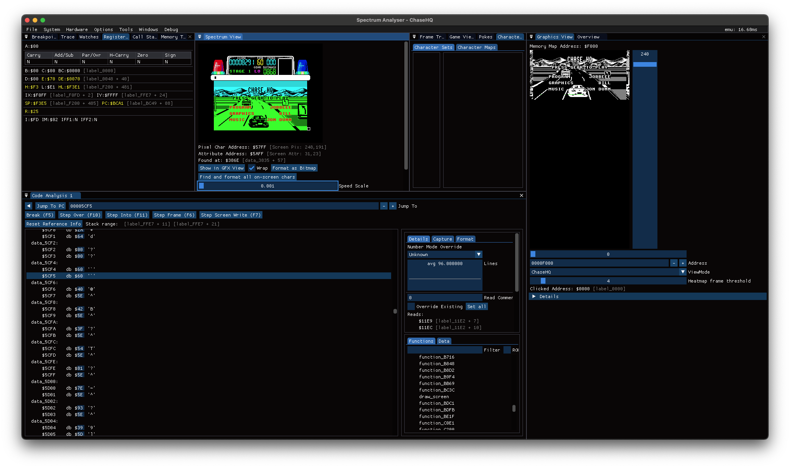
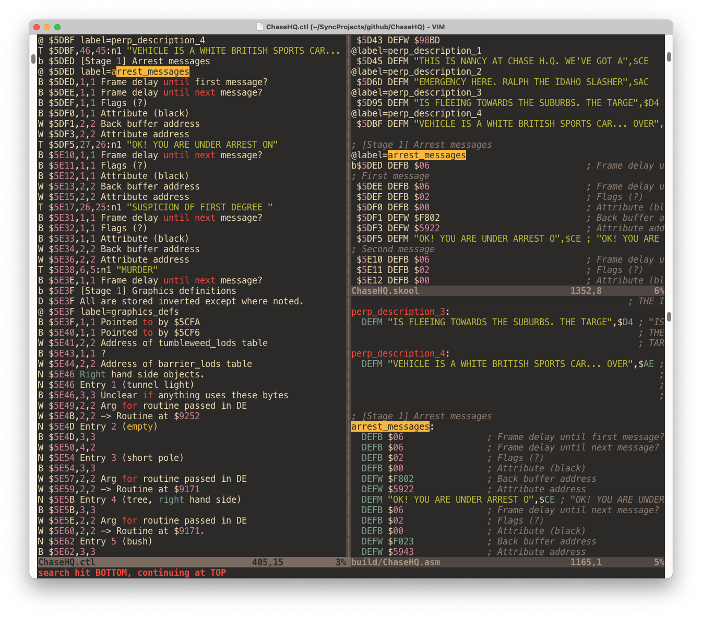

# Pulling apart Chase H.Q. for the ZX Spectrum

Reverse engineering by David Thomas

Project started: March 2023



This is the beginnings of a disassembly of the [ZX Spectrum version of Chase H.Q. by Ocean Software](https://spectrumcomputing.co.uk/entry/903/ZX-Spectrum/Chase_HQ). Initially this is only of the 48K version - and the first level/stage at that. The 128K version is better (loads all the levels at once, has AY music, menu screen animations, ...) but it has a lot more code to consider, so it's easier to start off with 48K stage 1 first.

In this repository is a [SkoolKit](https://skoolkit.ca/) _control_ file which you can use to disassemble the game. This works with the game when it is in a "pristine" just-loaded state. See below for how to make a pristine snapshot and instructions on how to drive SkoolKit. I've provided a Makefile to automate most of the required steps.

The current disassembly is [here](https://dpt.github.io/ChaseHQ/).

## WHY?

To find out how it works! (and maybe one day we could make new levels...)

## HOW TO

- Install SkoolKit:

``` sh
pip3 install skoolkit
```

- Download and convert the game into a .z80 format snapshot:

``` sh
make pristine
```

You'll see:

```
Downloading https://worldofspectrum.net/pub/sinclair/games/c/ChaseH.Q..tzx.zip
Extracting Chase HQ - Side 1.tzx
Program: CHASE HQ
Fast loading data block: 23755,3870
Data (514 bytes)
Data (6914 bytes)
Data (19074 bytes)
Data (16130 bytes)
Data (4 bytes)
Data (6898 bytes)
Tape finished
Simulation stopped (PC at start address): PC=23372
Writing chase-hq.z80
```

Build a skool file like so:

``` sh
make skool
```

A skool file is a high-level assembly listing from which we can generate regular assembly listings, or HTML disassemblies. Generated files are put in a directory called 'build' by default. You can edit the skool file and turn it back into another control file like so:

``` sh
make ctl
```

This makes it easy to pull your changes back into the main control file by doing:

``` sh
cp build/ChaseHQ.ctl ChaseHQ.ctl
```

Or you can diff the two to be more selective in your staging.

The bigger and more detailed the control file gets, the better our explanation of the game is!

Build an assembly listing like so:

``` sh
make asm
```

I usually edit with the three control, skool and assembly files all open so I can check the impact of my changes:


Build a tap or z80 file for loading into emulators or real Spectrums like so:

``` sh
make tap  # or z80
```

## HOW TO DETERMINE HOW THE GAME WORKS?

- Option (1) is to run the game in the [Spectrum Analyser interactive disassembler](https://colourclash.co.uk/spectrum-analyser/) and look for clues.
- Option (2) is to stare at the code _really hard_ until it makes sense.

You may have to do both.

See https://youtu.be/BGVI0TbePsQ for a short video of me running Spectrum Analyser to find out how the game builds its back buffer up.

## POKES

If you're not interested in the disassembly itself then a nice byproduct is POKEs to make the game easier, harder, or just different:

Infinite Credits  
POKE 39998,166

Infinite Time  
POKE 39937,0

1 Hit To Capture  
POKE 46351,62 

Infinite Turbos  
POKE 45221,0

Affect Car Spawn Rate  
POKE 23834,&lt;spawn rate&gt;  -- 20 is the default for Stage 1. 10 would spawn twice as often.  

Set Level Colour  
POKE 23796,&lt;attribute byte&gt;  -- 112 is black on yellow, as for Stage 1. 96 would give black on green.  
POKE 23797,&lt;attribute byte&gt;

## RELATED

Play Chase H.Q. online: http://torinak.com/qaop#!chasehq

Chat: https://matrix.to/#/#The-Great-Escape_Lobby:gitter.im

My previous disassembly project: https://github.com/dpt/The-Great-Escape

Spectrum Computing forums thread: https://spectrumcomputing.co.uk/forums/viewtopic.php?p=113633
