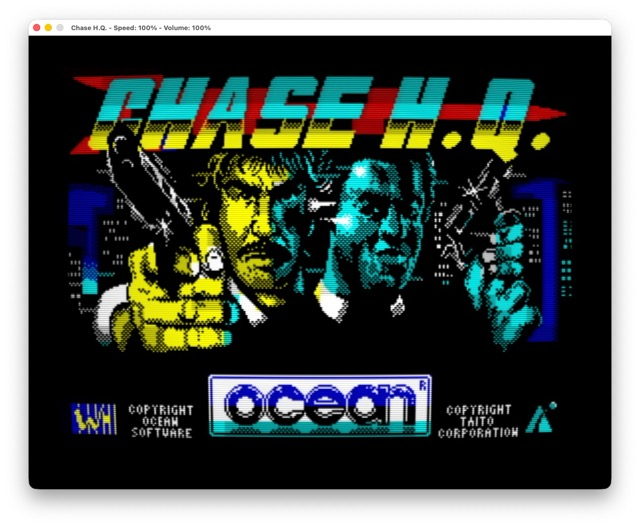

# _Chase H.Q._ for ZX Spectrum — reverse-engineered and reconstructed in portable C

by David Thomas, 2023-2026

This is an in-progress disassembly and rebuild of the
[ZX Spectrum conversion of Chase H.Q. by Ocean Software](https://spectrumcomputing.co.uk/entry/903/ZX-Spectrum/Chase_HQ).

  

## [`Speccy/`](Speccy/README.md) — the disassembly

A [SkoolKit](https://skoolkit.ca/) disassembly of the original game: control
files, skool files and a Makefile that fetches the tape, makes a pristine
snapshot and builds assembly listings, TAP/Z80 files and a cross-referenced HTML
disassembly. Just the 128K version is covered, with a control/skool file for
each paged bank.

The current disassembly output is
[available here](https://dpt.github.io/ChaseHQ/). POKEs for infinite credits,
time, turbos and more are listed in that README too.

## [`C/`](C/README.md) — the rebuild

A mostly hand-written, human-readable C reimplementation of the game engine,
translated function by function from the disassembly and keeping the original
game's Z80 addresses in the comments. It builds with CMake, links against SDL3
and plays through all five stages.

[Play it in your browser](https://dpt.github.io/ChaseHQ/play/) — an
Emscripten/WebAssembly build of the SDL3 app.

The two feed each other: the disassembly explains the game, the C port proves
the explanation is right. They get out of sync sometimes.

## [`C/apps/riscos/`](C/apps/riscos/README.md) — the native RISC OS application

A self-contained 32-bit `!ChaseHQ` desktop application, built from the same
engine sources. See that directory's README for build instructions and host
shortcuts.

## Links

- Project videos: https://www.youtube.com/watch?v=hWz7eTfn2l4&list=PLAn5dfRl63Oc
- Spectrum Computing forums thread:
  https://spectrumcomputing.co.uk/forums/viewtopic.php?p=113633
- Original artist Will Harbison's video about the game:
  https://www.youtube.com/watch?v=1pT6KOJFgMg
- Play the original Chase H.Q. online: http://torinak.com/qaop#!chasehq
- Lou's Pseudo 3D Page: https://www.extentofthejam.com/pseudo/index.html

## Related

- My previous Speccy disassembly project:
  https://github.com/dpt/The-Great-Escape
- ...and rebuild: https://github.com/dpt/The-Great-Escape-in-C
- My AY-8912 emulator: https://github.com/dpt/SlopAY
