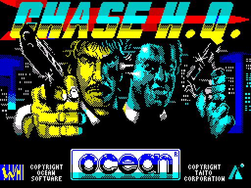

# _Chase H.Q._ for ZX Spectrum — reverse-engineered and reconstructed in portable C

by David Thomas, 2023-2026

This is an in-progress disassembly and rebuild of the [ZX Spectrum conversion of Chase H.Q. by Ocean Software](https://spectrumcomputing.co.uk/entry/903/ZX-Spectrum/Chase_HQ).

<p align="center">
  
</p>

## [`Speccy/`](Speccy/README.md) — the disassembly

A [SkoolKit](https://skoolkit.ca/) disassembly of the original game: control files, skool files and a Makefile that fetches the tape, makes a pristine snapshot and builds assembly listings, TAP/Z80 files and a cross-referenced HTML disassembly. Just the 128K version is covered, with a control/skool file for each paged bank.

The current disassembly output is [available here](https://dpt.github.io/ChaseHQ/). POKEs for infinite credits, time, turbos and more are listed in that README too.

## [`C/`](C/README.md) — the rebuild

A mostly hand-written, human-readable C reimplementation of the game engine, translated function by function from the disassembly and keeping the original game's Z80 addresses in the comments. It builds with CMake, links against SDL3 and plays through all five stages.

The two feed each other: the disassembly explains the game, the C port proves the explanation is right. They get out of sync sometimes.

## Native RISC OS application

The repository also builds a self-contained 32-bit `!ChaseHQ` desktop
application. It runs one 48K or 128K game in a Wimp window or in
single-tasking fullscreen mode. This first native release is deliberately
silent; AY and beeper audio are deferred.

The target requires a 32-bit RISC OS system with the Wimp, ColourTrans and
SpriteExtend. A 26-bit system is not supported. To build it, use a RISC OS
cross-build environment containing AMU, Norcroft C, RISC_OSLib and
`riscos-build-run`, then run these commands from the repository root:

``` sh
riscos-amu test
riscos-amu install INSTDIR=install
```

The test should print `ChaseHQ native tests passed`. The install command
creates `install/!ChaseHQ`; copy that application directory to the desired
RISC OS filer location, or run it from there. Generated `o32`, `aif32`,
`install` and `.rotransform` content is disposable and must not be committed.

Select the iconbar icon to open the game. The native host shortcuts are:

| Key | Action |
| --- | --- |
| `F2` / `F3` | Start a new 128K / 48K game |
| `F5` | Pause or resume |
| `F6` | Restart the selected machine version |
| `F7`–`F10` | Select window scale 1x–4x |
| `F11` | Enter fullscreen mode |
| `Escape` | Leave fullscreen mode |
| `Ctrl-Q` | Quit the application |

Gameplay keys are accepted only while the game window has the input caret.
The original Spectrum keyboard is available, and the arrow keys emulate a
Kempston joystick with keypad Enter as fire. Closing the game window stops
that game but leaves the iconbar application running.

Fullscreen mode uses the closest suitable 4-bpp mode by default. Set
`ChaseHQ$ScreenMode` to a RISC OS mode number or mode string to override it,
for example `X800 Y600 C16`. Only Escape is handled as a host shortcut while
fullscreen because the application deliberately does not poll the Wimp in
that mode.

## Links

- Project videos: https://www.youtube.com/watch?v=hWz7eTfn2l4&list=PLAn5dfRl63Oc
- Spectrum Computing forums thread: https://spectrumcomputing.co.uk/forums/viewtopic.php?p=113633
- Original artist Will Harbison's video about the game: https://www.youtube.com/watch?v=1pT6KOJFgMg
- Play the original Chase H.Q. online: http://torinak.com/qaop#!chasehq
- Lou's Pseudo 3D Page: https://www.extentofthejam.com/pseudo/index.html

## Related

- My previous Speccy disassembly project: https://github.com/dpt/The-Great-Escape
- ...and rebuild: https://github.com/dpt/The-Great-Escape-in-C
