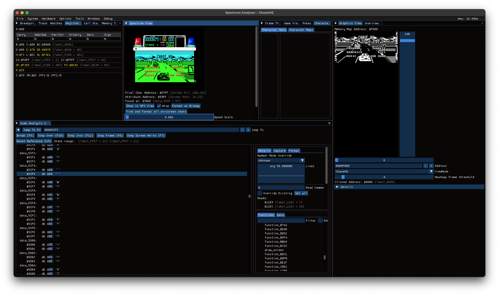

# Pulling apart _Chase H.Q._ for the ZX Spectrum

Reverse engineering by David Thomas, 2023-2026

Project started: March 2023



This is an in-progress disassembly and rebuild of the [ZX Spectrum conversion of Chase H.Q. by Ocean Software](https://spectrumcomputing.co.uk/entry/903/ZX-Spectrum/Chase_HQ).

**Note: I'm currently working on the 128K version of the game over on [the 128k branch](https://github.com/dpt/ChaseHQ/tree/128k). I've also started porting the game logic to C.**

In this repository is a [SkoolKit](https://skoolkit.ca/) _control_ file which you can use to disassemble the game. This disassembles the game when it's in a "pristine" just-loaded state. See below for how to make a pristine snapshot and instructions on how to drive SkoolKit. I've provided a Makefile to automate the required steps.

The current disassembly output is [available here](https://dpt.github.io/ChaseHQ/).

## Why?

To find out how it works! (and maybe one day we could make new levels...)

## Status

**Disassembly**: both the 48K (`ChaseHQ.ctl`) and 128K (`ChaseHQ-128K.ctl`) versions are under active disassembly. Most current effort is on 128K bank 3 — the title screen and its music/sound-effect driver.

**C port** (`C/`): a hand-written, human-readable reimplementation of the game engine — not a decompiler dump — built with CMake and SDL3.

- Engine logic translated across `Main.c` (~18k lines) and `Bank3.c` (~3.7k lines of 128K title-screen/tune code).
- All five stages now have real per-stage road and hazard data (`Stage1Data.c`–`Stage5Data.c`).
- The game runs and plays through the stages, but with known rough edges: title screen music/animation timing, perp-car jitter, an incomplete 128K options menu, and no game-finish screen yet — see `C/TODO.md` for the full list.

## How To Disassemble

- Install SkoolKit:

``` sh
pip3 install skoolkit
```

- Download and convert the game into a .z80 format snapshot:

``` sh
make pristine
```

You'll see:

```
Downloading https://worldofspectrum.net/pub/sinclair/games/c/ChaseH.Q..tzx.zip
Extracting Chase HQ - Side 1.tzx
Program: CHASE HQ
Fast loading data block: 23755,3870
Data (514 bytes)
Data (6914 bytes)
Data (19074 bytes)
Data (16130 bytes)
Data (4 bytes)
Data (6898 bytes)
Tape finished
Simulation stopped (PC at start address): PC=23372
Writing chase-hq.z80
```

Build a skool file like so:

``` sh
make skool
```

A skool file is a high-level assembly listing from which we can generate regular assembly listings, or HTML cross-referenced disassemblies. Generated files are put in a directory called 'build' by default. You can edit the skool file and turn it back into another control file like so:

``` sh
make ctl
```

This makes it easy to pull your changes back into the main control file by doing:

``` sh
cp build/ChaseHQ.ctl ChaseHQ.ctl
```

Or you can diff the two to be more selective in your staging.

The more detailed the control file gets the better our explanation of the game is!

Build an assembly listing like so:

``` sh
make asm
```

I usually edit with the control, skool and assembly files all open so I can check the impact of my changes:


Build a tap or z80 file for loading into emulators or real Spectrums like so:

``` sh
make tap  # or z80
```

## How do we determine how the game works?

- Option (1) is to run the game in the [Spectrum Analyser interactive disassembler](https://colourclash.co.uk/spectrum-analyser/) and look for clues.
- Option (2) is to stare at the code _really hard_ until it makes sense.

You will probably have to do both.

See https://youtu.be/ZcoFi4T4tsU for a short video of me running the game in Spectrum Analyser to find out how it builds its back buffer up.

## POKEs

If you're not interested in the workings of the game but just playing it then a nice byproduct is POKEs to make the game easier, harder, or just different:

* Infinite Credits  
`POKE 39998,166`

* Infinite Time  
`POKE 39937,0`

* 1 Hit To Capture  
`POKE 46351,62`

* Infinite Turbos  
`POKE 45221,0`

* Affect Car Spawn Rate  
`POKE 23834,`&lt;spawn rate&gt;  -- `20` is the default for Stage 1. `10` would spawn twice as often.  

* Set Level Colour  
`POKE 23796,`&lt;attribute byte&gt;  -- `112` is black on yellow, as for Stage 1. `96` would give black on green.  
`POKE 23797,`&lt;attribute byte&gt;

* Increase Maximum Speed
The word at 45461 sets the non-boosted maximum speed. The default internal value is 360 (which gives a max speed readout of 294). So you could try 450:

`POKE 45461,194`
`POKE 45462,1`

To restore the default of 360:

`POKE 45461,104`
`POKE 45462,1`

(Turbo speed is 695).

* Wider Roads (although they lean leftwards...)
`POKE 52382,169`  -- `217` is the default. `237` would give thin roads.

## Links

Spectrum Computing forums thread: https://spectrumcomputing.co.uk/forums/viewtopic.php?p=113633

Play Chase H.Q. online: http://torinak.com/qaop#!chasehq

## Related

My previous disassembly project: https://github.com/dpt/The-Great-Escape
