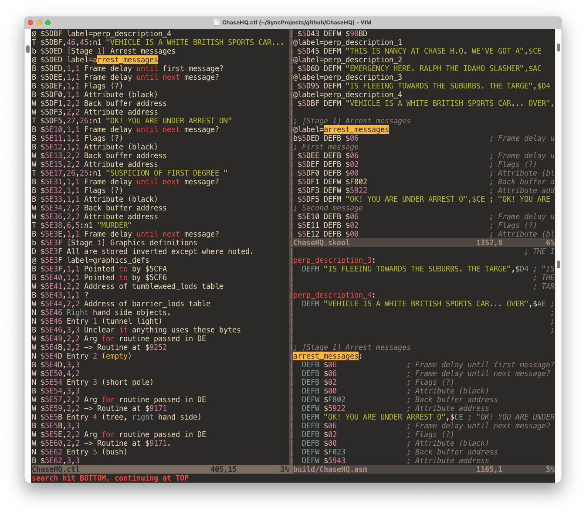

# Disassembling _Chase H.Q._ for the ZX Spectrum

Reverse engineering by David Thomas, 2023-2026


This directory holds the [SkoolKit](https://skoolkit.ca/) disassembly of the [ZX Spectrum conversion of Chase H.Q. by Ocean Software](https://spectrumcomputing.co.uk/entry/903/ZX-Spectrum/Chase_HQ): control files, skool files, ref files and a Makefile to drive them.

The disassembly works from a "pristine" just-loaded snapshot of the game. The Makefile automates fetching the tape, making that snapshot and running SkoolKit. Run all `make` commands below from inside `Speccy/`.

The current disassembly output is [available here](https://dpt.github.io/ChaseHQ/).

See the [sister project README](../C/README.md) for the C rebuild of the game.

## Why?

To find out how it works!

## Status

Only the 128K (`ChaseHQ-128K.ctl`) version is under active disassembly. There is one control/skool file per paged bank (`ChaseHQ-128K-bank-{1,3,4,6,7}`). Most current effort is on 128K bank 3 — the title screen and its music/sound-effect driver.

## How To Disassemble

1. Install SkoolKit:

   ``` sh
   pip3 install skoolkit
   ```

2. Download the game and convert it into a .z80 snapshot:

   ``` sh
   make pristine
   ```

   You'll see:

   ```
   Downloading https://worldofspectrum.net/pub/sinclair/games/c/ChaseH.Q..tzx.zip
   Extracting Chase HQ - Side 1.tzx
   Program: CHASE HQ
   Fast loading data block: 23755,3870
   Data (514 bytes)
   Data (6914 bytes)
   Data (19074 bytes)
   Data (16130 bytes)
   Data (4 bytes)
   Data (6898 bytes)
   Tape finished
   Simulation stopped (PC at start address): PC=23372
   Writing chase-hq.z80
   ```

3. Build a skool file:

   ``` sh
   make skool
   ```

   A skool file is a high-level assembly listing. From it, SkoolKit can generate a regular assembly listing or an HTML cross-referenced disassembly. Generated files go into a `build` directory by default.

4. Build an assembly listing:

   ``` sh
   make asm
   ```

   I usually keep the control, skool and assembly files open together, so I can check the effect of each change:
   

5. Build a TAP or Z80 file, for loading into emulators or real Spectrums:

   ``` sh
   make tap  # or: make z80
   ```

`make usage` lists every target.

### Editing the control file

The control file drives everything else, so most of the real work is editing it and regenerating the skool file to check the result. The more detailed the control file gets, the better the explanation of the game.

You can edit the skool file directly and turn it back into a control file:

``` sh
make ctl
```

Then pull your changes back into the main control file:

``` sh
cp build/ChaseHQ-128K.ctl ChaseHQ-128K.ctl
```

Or diff the two files to be more selective about what you keep. `make commit` does the same job for the whole set of control files at once.

## How do we determine how the game works?

- Option (1) is to run the game in the [Spectrum Analyser interactive disassembler](https://colourclash.co.uk/spectrum-analyser/) and look for clues.
- Option (2) is to stare at the code _really hard_ until it makes sense.

You will probably have to do both.

See https://youtu.be/ZcoFi4T4tsU for a short video of me running the game in Spectrum Analyser to find out how it builds its back buffer up.

## Scripts

`scripts/` holds the tools built along the way:

- `CHQStage.py` — standalone stage data decoder, run over a `skool2bin.py` dump.
- `skooltraceregs.py`, `trace_calibrate.py` — emulator trace helpers.

The skool-to-C stage converter lives with the code it generates, in [`C/scripts/convert_stage.py`](../C/scripts/convert_stage.py).

## POKEs

If you are not interested in how the game works and just want to play it, here are some POKEs to make the game easier, harder or just different:

- Infinite Credits  
`POKE 39998,166`

- Infinite Time  
`POKE 39937,0`

- 1 Hit To Capture  
`POKE 46351,62`

- Infinite Turbos  
`POKE 45221,0`

- Affect Car Spawn Rate  
`POKE 23834,`&lt;spawn rate&gt;  -- `20` is the default for Stage 1. `10` would spawn twice as often.  

- Set Level Colour  
`POKE 23796,`&lt;attribute byte&gt;  -- `112` is black on yellow, as for Stage 1. `96` would give black on green.  
`POKE 23797,`&lt;attribute byte&gt;

- Increase Maximum Speed
The word at 45461 sets the non-boosted maximum speed. The default internal value is 360 (which gives a max speed readout of 294). So you could try 450:

`POKE 45461,194`
`POKE 45462,1`

To restore the default of 360:

`POKE 45461,104`
`POKE 45462,1`

(Turbo speed is 695).

- Wider Roads (although they lean leftwards...)
`POKE 52382,169`  -- `217` is the default. `237` would give thin roads.
